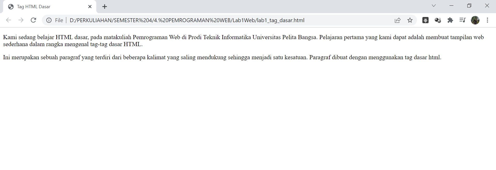

# Leb1Web
## Tugas Pemrograman web - Pertemuan Ke 2

Nama    : Rudi Hartono

NIM     : 312010027

Kelas   : TI.20.B1

*Pada pertemuan ke 2 matakuliah pemrograman web, saya akan melakukan beberapa perintah pada HTML*
 
- Menampilkan Title HTML pada browser  

 

1. **Membuat paragraf**
 
pada poin ini kita akan membuat paragraf pada file HTML.
pada sintax p bertujuan untuk membuat paragraf baru. berikut tampilan nya seperti gambar di bawah.

2. **Menambahkan Judul**
 
Pada poin ini kita akan menambahkan judul pada file HTML.
seperti contoh pada tampilan gambar berikut.

3. **Memformat teks**
 
pada poin kali ini kita akan memformat teks pada paragraf teks yang usdah ada sebelumnya. seperti contoh gambar di bawah ini.

4. **Menambahkan Gambar**
 
Pada poin ke empat ini kita akan menambahkan gambar/logo apa pun itu pada file HTML ini. Seperti contoh pada gambar di bawah ini.

5. **Menambahkan Hyperlink**
 
pada poin terakhir kali ini kita akan menambahkan hyperlink pada file HTML ini. seperti contoh gambar di bawah ini.

> ##Pertanyaan##
>
> Jawab Pertanyaan Berikut
>
> 1. Lakukan perubahan pada kode sesuai dengan keinginan anda, amati perubahannya adakah 
error ketika terjadi kesalahan penulisan tag?
> 2. Apa perbedaan dari tag \
 dengan tag \ , berikan penjelasannya!
> 3. Apa perbedaan atribut title dan alt pada tag \, berikan penjelasannya!
> 4. Untuk mengatur ukuran gambar, digunakan atribut width dan height.Agar tampilan gambar 
proporsional sebaiknya kedua atribut tersebut diisi semua atau tidak? Berikan penjelasannya!
> 5. Pada link tambahkan atribut target dengan nilai atribut bervariasi ( _blank, _self, _top, _parent ), apa yang terjadi pada masing-masing nilai antribut tersebut?

